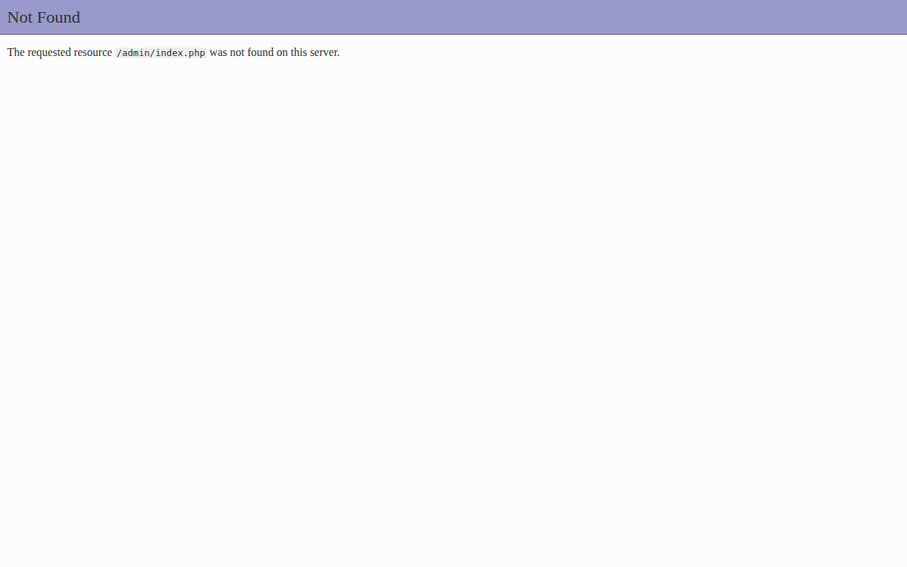
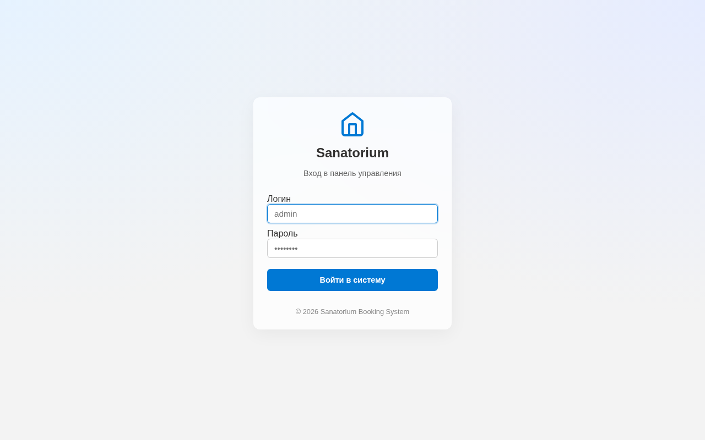
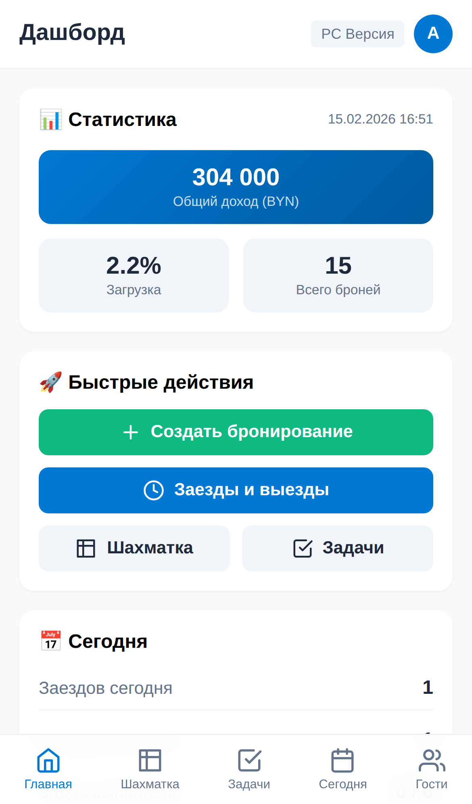
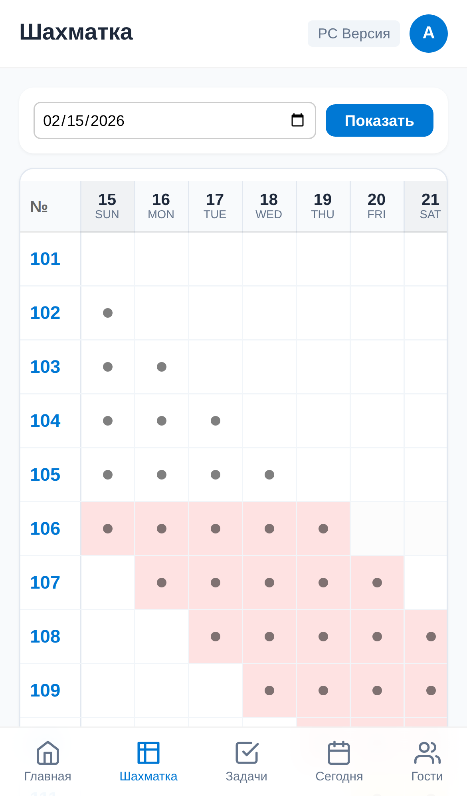
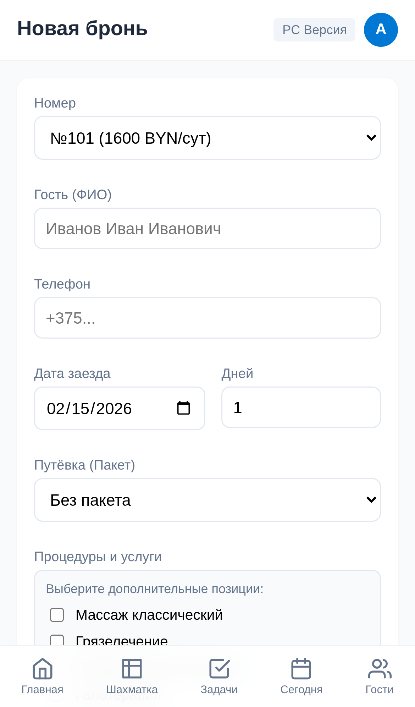

# Руководство пользователя wesbooking System

Система wesbooking System предназначена для автоматизации управления санаторием, включая бронирование номеров, учет процедур, планирование задач персонала и аналитику.

---

## 1. Начало работы и авторизация

Для доступа в панель управления перейдите по адресу вашего сайта: `/admin/`.
Система использует автономную систему пользователей.

---

## 2. Главная панель (Дашборд)

После входа вы попадаете на главную панель, где отображается оперативная информация за текущий день.

**Основные блоки:**
*   **Статистика:** Общий доход, загрузка в процентах, количество активных броней.
*   **Заезды и выезды:** Список гостей, прибывающих или убывающих сегодня.
*   **Задачи:** Список текущих задач для персонала (уборка, ремонт и т.д.).

---

## 3. Шахматка (Календарь занятости)

Это основной инструмент управления номерным фондом.

**Функционал:**
*   **Визуализация:** Отображение статусов всех номеров на временной сетке.
*   **Интерактивность:** Клик на свободную ячейку открывает форму быстрого бронирования. Клик на занятую ячейку открывает карточку бронирования.

---

## 4. Оперативная работа (Сегодня)

Раздел «Сегодня» предназначен для быстрой обработки заездов и выездов.

---

## 5. Планирование задач

Раздел «Планирование» позволяет ставить задачи персоналу.

*   **Статусы:** Задачи могут быть «В работе» или «Завершены».

---

## 6. Мобильный интерфейс

Мобильная версия оптимизирована для работы персонала «в полях» (горничные, медсестры).

**Возможности мобильной версии:**
*   **Список задач:** Персонал отмечает выполнение задач прямо в телефоне.
*   **Быстрое бронирование:** Возможность забронировать номер на месте.

---

## 7. Аналитика и отчеты

Раздел аналитики предоставляет данные для принятия управленческих решений.

---

## 8. Состояние системы и уведомления

Система включает инструменты для мониторинга работоспособности и информирования персонала.

### 8.1. Состояние системы (Health Check)
На странице «Состояние системы» администратор может проверить целостность файлов и настроек.
*   **Авто-исправление:** Если системные файлы (например, база данных номеров) повреждены или отсутствуют, кнопка «Исправить всё» автоматически восстановит структуру данных.

### 8.2. Уведомления в Telegram
Система поддерживает мгновенную отправку уведомлений о новых бронированиях.
*   **Настройка:** В разделе «Настройки» укажите Token вашего бота и ID чата.
*   **Инструкция:** Подробная инструкция по созданию бота в Telegram встроена прямо в интерфейс настроек.

---

## Техническая поддержка

Система разработана для обеспечения максимальной автономности и безопасности данных. Все данные хранятся локально в формате JSON с регулярным резервным копированием.
