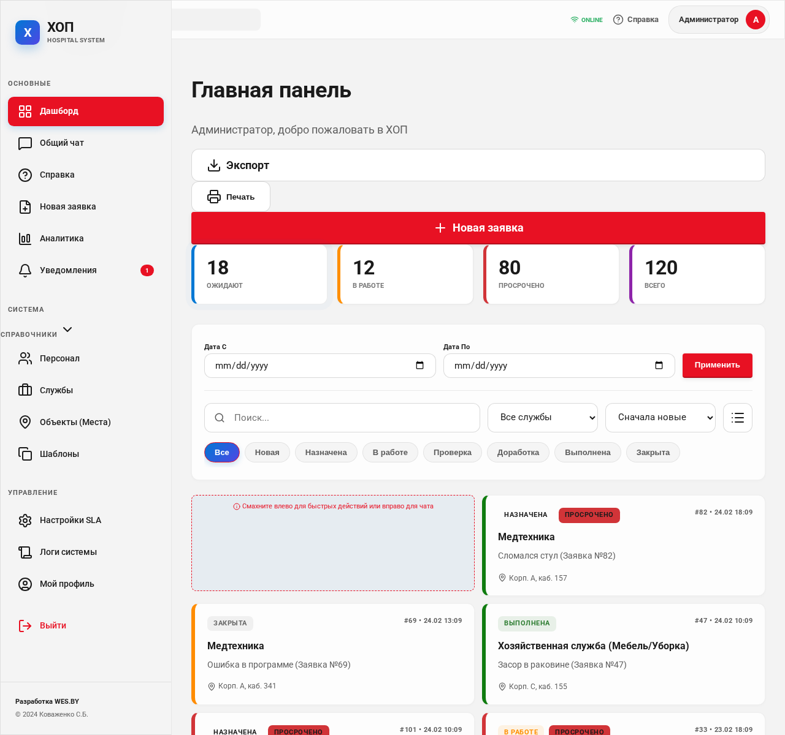
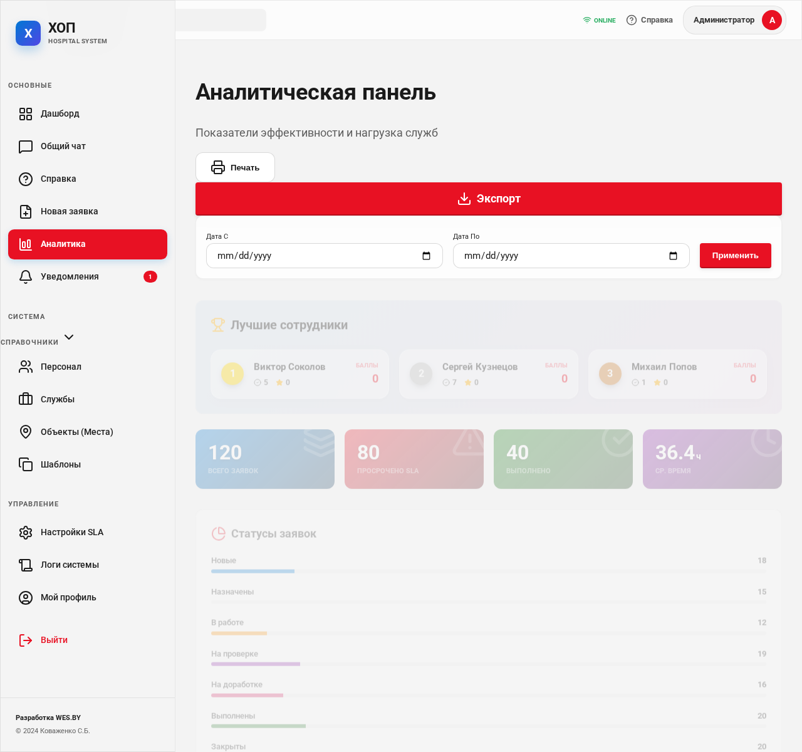
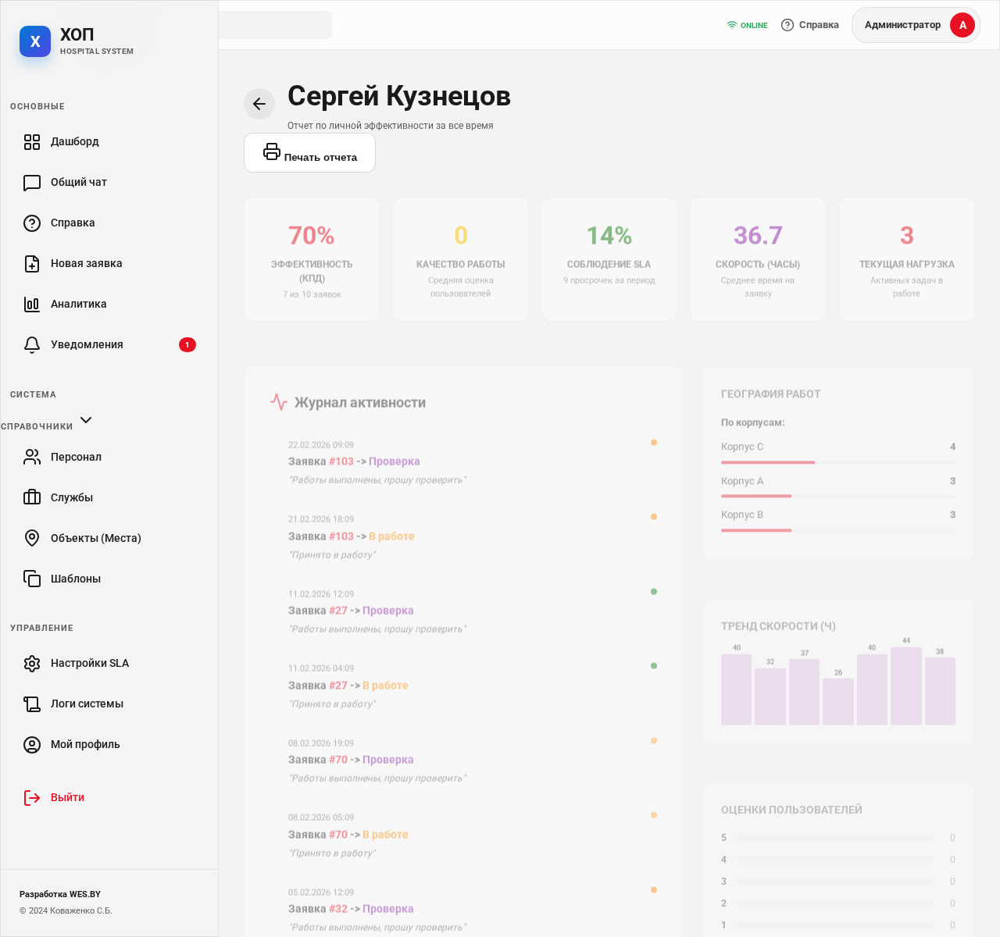

# ОФИЦИАЛЬНОЕ ПРЕДЛОЖЕНИЕ ПО ВНЕДРЕНИЮ СИСТЕМЫ «ХОП» (Хозяйственно-Оперативные Поручения)

**Отправитель:** Коваженко Сергей Борисович, заведующий хозяйством (завхоз).
**Тема:** Автоматизация и цифровизация службы АХЧ и технических подразделений медицинского учреждения.

---

### Уважаемые коллеги и руководство!

Добрый день! Меня зовут Сергей Борисович Коваженко. Работая заведующим хозяйством в больнице, я каждый день сталкиваюсь с колоссальным объемом оперативных задач: от перегоревшей лампочки в операционной до срочного ремонта сантехники в приемном покое.

Годы практики показали, что традиционные методы управления — записи в журналах, телефонные звонки, устные просьбы — безнадежно устарели. Информация теряется, сроки нарушаются, а оценить реальную нагрузку сотрудников и эффективность служб практически невозможно.

Исходя из этого опыта, я разработал специализированное программное обеспечение **«ХОП» (Хозяйственно-Оперативные Поручения)**. Это не просто «еще одно приложение», это рабочий инструмент, созданный «от земли» для решения конкретных болей медицинского персонала и администрации.

---

## 1. Концепция и ключевые преимущества

Система «ХОП» — это веб-приложение, работающее по принципу **Mobile-First**. Это значит, что оно идеально работает на смартфонах, которые всегда в кармане у санитарок, инженеров и мастеров.

**Основные принципы:**
*   **Прозрачность:** Каждая заявка имеет автора, исполнителя, историю изменений и фотофиксацию.
*   **Скорость:** Передача заявки от отделения до мастера занимает 2 секунды.
*   **Контроль:** Система автоматически подсвечивает просроченные задачи и присылает уведомления.
*   **Автономность:** Программа не требует дорогостоящих серверов и баз данных — все работает на легком и надежном движке.

---

## 2. Функциональные возможности

### 2.1. Ролевая модель доступа
В программе реализовано 6 уровней доступа, что обеспечивает строгую дисциплину:
1.  **Инициатор (Медсестра/Врач):** Создает заявку за 3 клика.
2.  **Исполнитель (Мастер/Слесарь):** Видит только свои задачи, меняет статусы «в работе» / «выполнено».
3.  **Ответственный службы (Бригадир):** Распределяет задачи между подчиненными.
4.  **Контроллер:** Проверяет качество (подтверждает выполнение или возвращает на доработку).
5.  **Руководитель (Главврач/Завхоз):** Видит общую аналитику, графики и отчеты.
6.  **Администратор:** Управляет структурой больницы и правами доступа.

### 2.2. Жизненный цикл заявки
Каждое поручение проходит через четкую цепочку статусов:
`Новая` ➔ `Назначена` ➔ `В работе` ➔ `Ожидает проверки` ➔ `Выполнена` ➔ `Закрыта (Архив)`.

### 2.3. Фотофиксация и Чат
К каждой заявке можно прикрепить фото проблемы (ДО) и результата (ПОСЛЕ). Внутри каждой задачи есть встроенный чат для оперативного уточнения деталей без лишних звонков.

---

## 3. Визуальный интерфейс и работа в системе

Программа выполнена в современном стиле **Windows 11 (Mica)**, что делает её привычной и понятной для любого пользователя ПК и смартфона.

### 3.1. Рабочий стол и Навигация
Для мобильных устройств предусмотрена удобная нижняя панель навигации (Задачи, Чат, Инфо, Профиль), что позволяет работать одной рукой буквально «на бегу».

> 
> *На экране видна нижняя панель управления и список активных карточек задач с цветовой индикацией приоритетов.*

### 3.2. Создание заявки
Форма создания заявки максимально упрощена. Инициатор выбирает службу (сантехники, электрики, IT), указывает место (корпус, этаж, кабинет) и прикрепляет фото. Система сама определяет приоритет и нормативное время выполнения (SLA).

### 3.3. Аналитическая панель (Для руководства)
Это «сердце» системы для управления. Руководитель видит:
*   Количество заявок в разрезе служб.
*   Рейтинг эффективности сотрудников (KPI).
*   Среднее время реакции на критические инциденты.
*   Динамику нагрузки за последние 10 дней.

> 
> *Графики нагрузки, счетчики выполненных и просроченных задач, таблицы эффективности подразделений.*

### 3.4. Отчетность и Поиск
Система позволяет мгновенно найти любую заявку по номеру или ключевым словам. Для каждого сотрудника формируется персональный отчет о проделанной работе, который можно использовать для премирования или аттестации.

> 
> *Персональная карточка эффективности сотрудника с расчетом KPI и списком выполненных работ.*

---

## 4. Технические особенности (Почему это надежно?)

*   **Работа при слабом интернете:** Система кэширует данные. Если в подвале пропала сеть, мастер может нажать «Выполнено», и данные отправятся автоматически при выходе в зону приема.
*   **Безопасность:** Вход осуществляется по персональному коду. Данные зашифрованы и защищены от внешнего доступа.
*   **Интеграция с Telegram:** Ответственные получают уведомления о новых аварийных заявках прямо в мессенджер.
*   **Простая установка:** Программа не требует сложной настройки — достаточно скопировать файлы на любой внутренний веб-сервер больницы.

---

## 5. Экономический и социальный эффект

1.  **Экономия времени:** Сокращение времени на передачу и уточнение заявок на 40%.
2.  **Удлинение срока службы оборудования:** За счет своевременного технического обслуживания.
3.  **Повышение лояльности персонала:** Врачи и медсестры не тратят время на поиск завхоза, а занимаются лечением пациентов.
4.  **Дисциплина:** Персональная ответственность каждого исполнителя за каждый вкрученный болт.

---

### Заключение

Система «ХОП» — это результат моего многолетнего опыта и желания сделать работу нашей больницы более организованной и современной. Я готов лично провести презентацию, обучить сотрудников и адаптировать систему под специфику любого отделения.

**С уважением,**
**Коваженко Сергей Борисович**
Заведующий хозяйством.
*Разработано для профессионалов, которые ценят порядок.*
