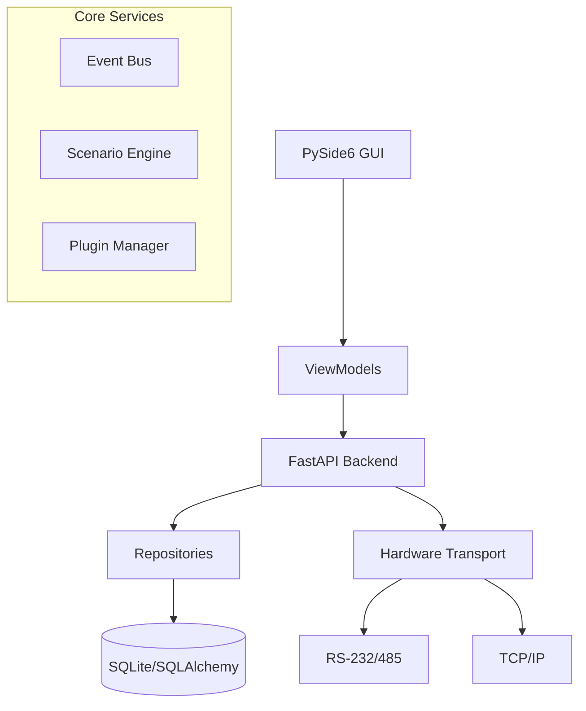

# Orion Config Pro

Modern configuration platform for Bolid Orion / S2000 / S2000M security systems.

## Architecture



### Key Components

- **Domain Layer**: Entities (`Device`, `Zone`, `Relay`, etc.) and Pydantic schemas.
- **Infrastructure**: Async database management and hardware transport layer.
- **Service Layer**: Event-driven scenario processing and plugin system.
- **API**: Modular REST interface for local/remote management.
- **GUI**: MVVM-based Desktop interface with docking panels and visual editors.

## Getting Started

1. Install dependencies:
   ```bash
   pip install .
   ```
2. Run the application:
   ```bash
   python main.py
   ```

## Testing

Run tests with pytest:
```bash
pytest
```
