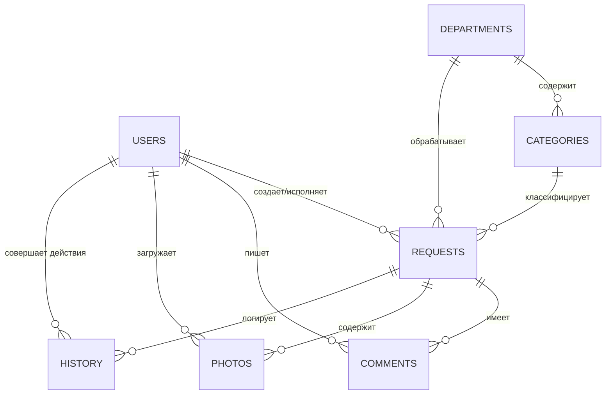

# Проектная документация: Helpdesk Enterprise v6.0 🧩
**Разработчик:** Kovazenko S.B.

## 1. Архитектура системы
Система построена на базе WordPress как высокоуровневый плагин, использующий кастомные таблицы базы данных для обеспечения максимальной производительности и целостности данных.

*   **Core Engine**: PHP 7.4+ / WordPress 5.8+
*   **Database**: MySQL/MariaDB (Custom Tables)
*   **Frontend**: Vanilla JS, AJAX, Tailwind-inspired CSS
*   **Integration**: Telegram Bot API (Webhooks/Long polling)
*   **Security**: Autonomous User System (hd_users), PHP Sessions, Custom RBAC, API Tokens
*   **Extensibility**: Модульная структура, полноценный REST API для Android-приложения.

---

## 2. Шорткоды (Shortcodes)
Для удобства размещения в личном кабинете предусмотрены следующие шорткоды:
*   `[hd_dashboard]` — Полный интерфейс (статистика + список + форма).
*   `[hd_request_form]` — Только форма создания заявки.
*   `[hd_request_list]` — Только список заявок пользователя.

---

## 3. ER-диаграмма (Схема сущностей)



---

## 3. Описание API (Internal AJAX)

| Action (AJAX) | Method | Description | Roles |
| :--- | :--- | :--- | :--- |
| `hd_login`          | POST | Авторизация в системе  | Any                |
| `hd_logout`         | POST | Выход из системы       | Any                |
| `hd_create_request` | POST | Создание новой заявки | Responsible, Admin |
| `hd_get_request_details`| POST | Получение данных заявки | All (with limits) |
| `hd_update_status` | POST | Изменение статуса | Executor, Manager, Admin |
| `hd_add_comment` | POST | Добавление комментария | All (involved) |

### 4.2. External REST API (для Android)
Base URL: `/wp-json/hd/v1/`
Auth: Header `X-HD-Token: <api_token>`

| Endpoint | Method | Description |
| :--- | :--- | :--- |
| `/login` | POST | Обмен username/password на token |
| `/requests` | GET | Получение списка заявок |
| `/requests/{id}` | GET | Детальная информация по заявке |
| `/requests` | POST | Создание новой заявки |
| `/comments` | POST | Добавление комментария |
| `/status` | POST | Смена статуса заявки |

#### Примеры запросов (JSON)

**Создание заявки:**
`POST /wp-json/hd/v1/requests`
```json
{
  "title": "Проблема с доступом",
  "description": "Не могу войти в систему под своим паролем",
  "category_id": 5
}
```

**Добавление комментария:**
`POST /wp-json/hd/v1/comments`
```json
{
  "request_id": 1024,
  "content": "Проверьте почту, мы выслали инструкции."
}
```

---

## 4. Бизнес-логика

### 4.1. Жизненный цикл заявки
1.  **Создание**: Ответственный создает заявку -> Авто-определение отдела -> Авто-назначение исполнителя -> Расчет SLA.
2.  **Обработка**: Исполнитель меняет статус (В работе, Ожидание).
3.  **Контроль**: Руководитель может переназначить или изменить срок.
4.  **Завершение**: Статус "Выполнено" или "Отклонено".

### 4.2. Модель SLA
Алгоритм учитывает:
*   Базовые часы категории.
*   **Приоритет заявки** (Low x1.5, Medium x1.0, High x0.5, Critical x0.25).
*   Рабочий график отдела (например, 09:00 - 18:00).
*   Обеденный перерыв (исключается из расчета).
*   Выходные и праздничные дни.
*   Если заявка подана в нерабочее время, отсчет начинается с начала следующего рабочего дня.

---

## 5. Роли и права (RBAC)

| Роль | Просмотр | Создание | Упр. статусом | Упр. сроком/исполнителем | Удаление |
| :--- | :--- | :--- | :--- | :--- | :--- |
| **Администратор** | Все | Да | Любой | Любой | Да (всё) |
| **Руководитель** | Отдел | Нет | В отделе | В отделе | Нет |
| **Исполнитель** | Свои | Нет | Свои | Нет | Нет |
| **Ответственный**| Свои | Да | Нет | Нет | Нет |

---

## 6. Схема уведомлений (Telegram)

| Событие | Получатели | Содержимое |
| :--- | :--- | :--- |
| Новая заявка | Исп., Рук., Админ | ID, Заголовок, SLA |
| Смена статуса | Отв., Рук., Админ | Новый статус, ID |
| Смена исполнителя| Исп. (нов/стар), Рук. | ФИО нового исполнителя |
| Новый комментарий| Все участники | Текст комментария |
| Просрочка SLA | Исп., Рук., Админ | ⚠️ ALERT: Заявка просрочена |

---

## 7. Структура БД (SQL)

```sql
CREATE TABLE `hd_users` (
  `id` bigint(20) NOT NULL AUTO_INCREMENT,
  `username` varchar(60) NOT NULL,
  `password` varchar(255) NOT NULL,
  `email` varchar(100) NOT NULL,
  `display_name` varchar(250) NOT NULL,
  `role` varchar(50) NOT NULL,
  `telegram_chat_id` varchar(100) DEFAULT NULL,
  `created_at` datetime DEFAULT CURRENT_TIMESTAMP,
  PRIMARY KEY (`id`),
  UNIQUE KEY `username` (`username`)
);

CREATE TABLE `hd_requests` (
  `id` bigint(20) NOT NULL AUTO_INCREMENT,
  `title` varchar(255) NOT NULL,
  `description` longtext NOT NULL,
  `category_id` bigint(20) NOT NULL,
  `department_id` bigint(20) NOT NULL,
  `responsible_id` bigint(20) NOT NULL,
  `executor_id` bigint(20) DEFAULT 0,
  `status` varchar(50) NOT NULL DEFAULT 'new',
  `created_at` datetime DEFAULT CURRENT_TIMESTAMP,
  `deadline` datetime DEFAULT NULL,
  `completed_at` datetime DEFAULT NULL,
  PRIMARY KEY (`id`)
);
```

---

## 8. Примеры данных (JSON)

**Ответ на запрос деталей заявки:**
```json
{
  "success": true,
  "data": {
    "id": 1024,
    "title": "Сбой сетевого принтера",
    "status": "in_progress",
    "deadline": "2026-02-05 14:00:00",
    "executor": "Иван Иванов",
    "comments": [
      {
        "user": "Сергей Петров",
        "text": "Нужны драйверы для MacOS",
        "date": "2026-02-02 11:30"
      }
    ]
  }
}
```

---

## 9. Примеры Telegram-уведомлений

> 🆕 **Новая заявка #1024**
> **Заголовок:** Сбой сетевого принтера
> **Категория:** IT / Техподдержка
> **Срок (SLA):** 05.02.2026 14:00
> [Открыть в системе]

---

## 10. Интерфейсы (UX/UI)

### 10.1. Dashboard
Центральный хаб с **блоками статистики** (Всего, Новые, В работе, Выполнено, Просрочено). Включает фильтры по статусам и категориям. Цветовая индикация сроков:
*   **Обычный**: В рамках SLA.
*   **Красный/Жирный**: Просрочено.

### 10.2. Карточка заявки
Разделена на блоки: Инфо (с расчетом факта и просрочки), Вложения (фото с возможностью удаления), Комментарии и Таймлайн истории. История защищена от изменений — "Immutable Audit Log". Фиксируются все действия, включая удаления.

---

## 11. Масштабируемость (Mobile App Ready)
Архитектура позволяет легко подключить мобильное приложение через:
1.  **WP REST API**: Создание эндпоинтов `/wp-json/hd/v1/requests`.
2.  **JWT Authentication**: Безопасный доступ для внешних клиентов.
3.  **Firebase/OneSignal**: Для Push-уведомлений на смартфоны.
